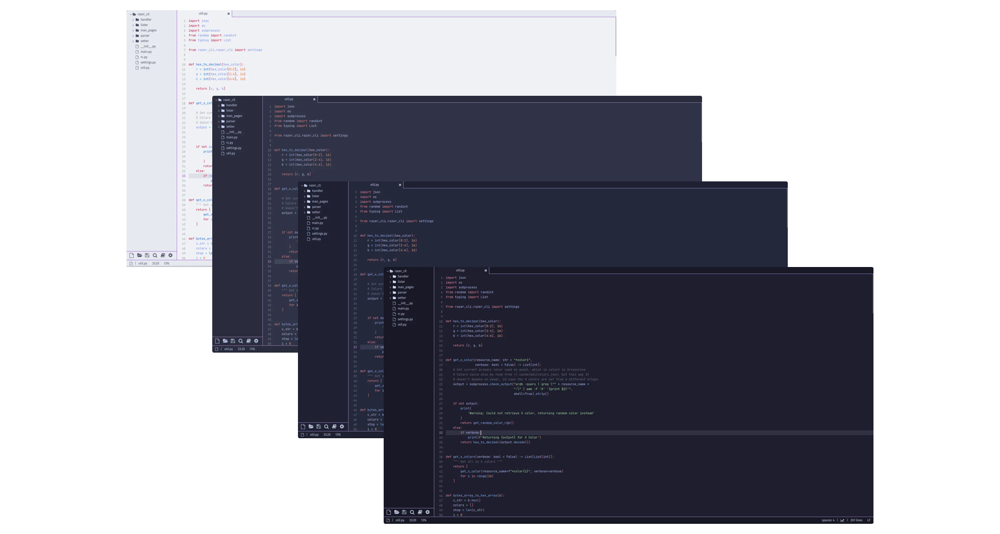
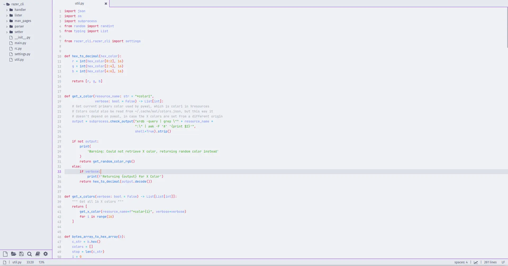
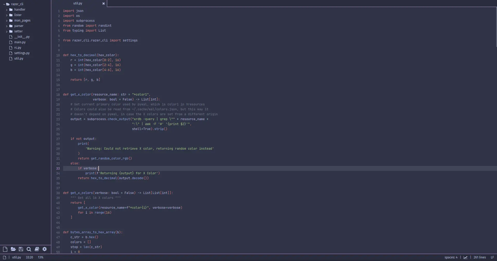
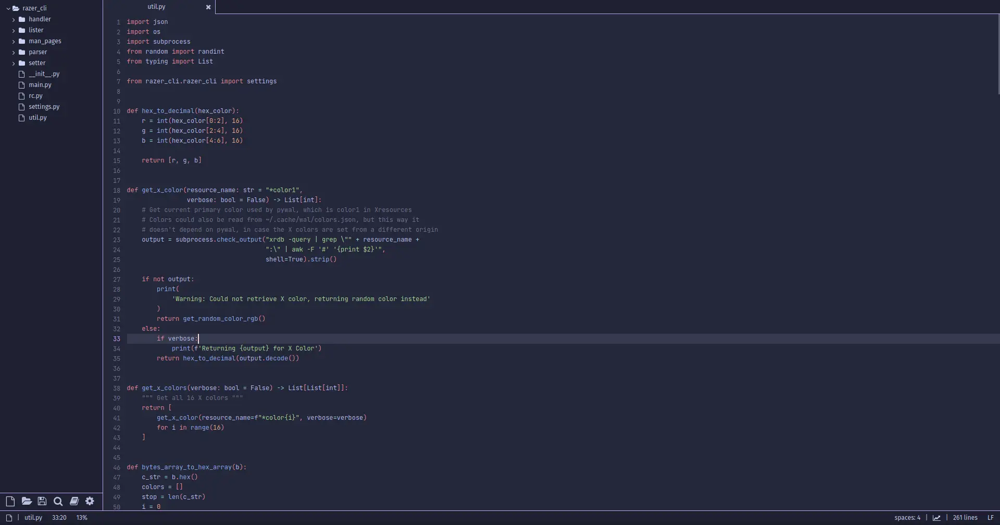
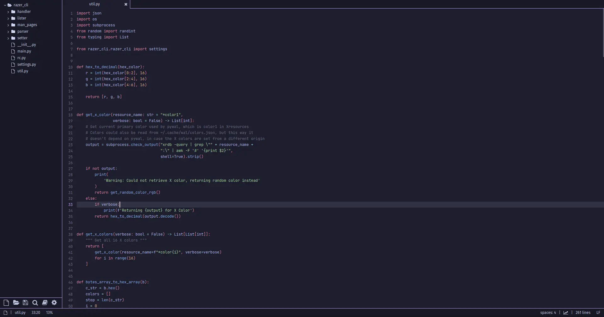

<h3 align="center">
	<br/>
	
	Catppuccin for <a href="https://lite-xl.com/">Lite XL</a>
	
</h3>

<p align="center">
	
</p>

## Previews

<details>
<summary>🌻 Latte</summary>

</details>
<details>
<summary>🪴 Frappé</summary>

</details>
<details>
<summary>🌺 Macchiato</summary>

</details>
<details>
<summary>🌿 Mocha</summary>

</details>

## Usage

To install a color scheme, drop the `catppuccin-<theme>.lua` file from the colors folder directly into:

*   Linux `~/.config/lite-xl/colors/`
*   MacOS `~/.config/lite-xl/colors/`
*   Windows `C:\Users\(username)\.config\lite-xl\colors\`

Then, add a call to `core.reload_module` to your user module (the gear in the bottom left corner). As an example, if you installed the `catppuccin-mocha.lua` file into your colors folder, you'd load it with:

```lua
core.reload_module("colors.catppuccin-mocha")
```


## 💝 Thanks to

- [Garbg](https://github.com/Garbg)

&nbsp;

<p align="center">
	
</p>

<p align="center">
	Copyright &copy; 2021-present <a href="https://github.com/catppuccin" target="_blank">Catppuccin Org</a>
</p>

<p align="center">
	<a href="https://github.com/catppuccin/catppuccin/blob/main/LICENSE"></a>
</p>
